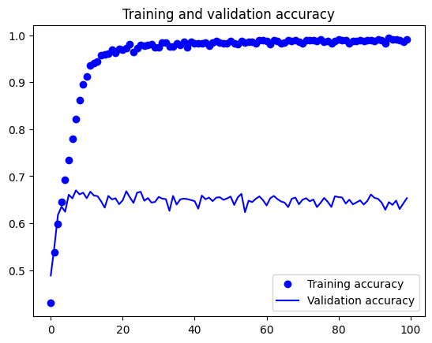
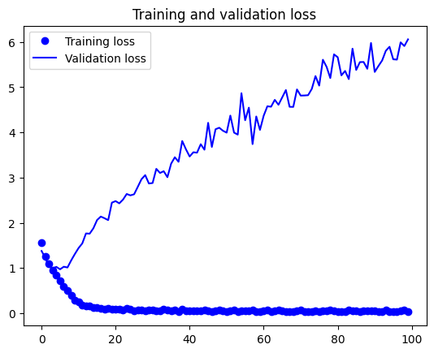

# Skin_Cancer-CNN
Skin Cancer Classification with convolutional neural network
 
There are 8 categories of skin cancer classification, with the data distribution as follows.  

AK: 735 images 
BCC: 3223 images 
BKL: 2524 images 
DF: 139 images 
MEL: 4422 images 
NV: 12775 images 
SCC: 528 images 
VASC: 153 images 

The accuracy obtained is 44.862%

Found 14346 correct labels  
Found 17654 incorrect labels  
    
        precision     recall   f1-score  support

         Class 0       0.32      0.45      0.37      4000
         Class 1       0.36      0.30      0.32      4000
         Class 2       0.36      0.25      0.30      4000
         Class 3       0.60      0.43      0.50      4000
         Class 4       0.48      0.27      0.35      4000
         Class 5       0.51      0.63      0.57      4000
         Class 6       0.30      0.46      0.37      4000
         Class 7       0.77      0.80      0.78      4000

        accuracy                           0.45     32000
       macro avg       0.46      0.45      0.44     32000
    weighted avg       0.46      0.45      0.44     32000